# 🌩️ Cloudforall AWS Capstone Project  
### Multi-Tier, Highly Available & Highly Scalable Architecture on AWS

This project demonstrates how to design and deploy a **production-grade multi-tier architecture** on AWS.  
It includes a VPC, public/private subnets, load balancer, Auto Scaling Group, RDS, S3, CloudFront, IAM, SSM and follows real AWS best practices.

---

# 🏗️ Architecture Diagram & Setup Screenshots

## **1️⃣ VPC & Subnets**

### VPC
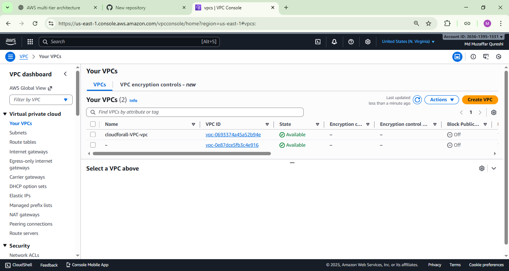

### Subnets
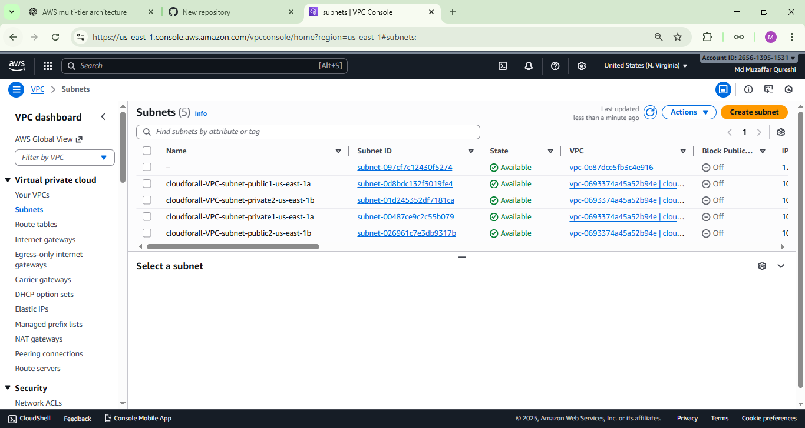

---

## **2️⃣ Internet Gateway & Route Tables**

### Internet Gateway
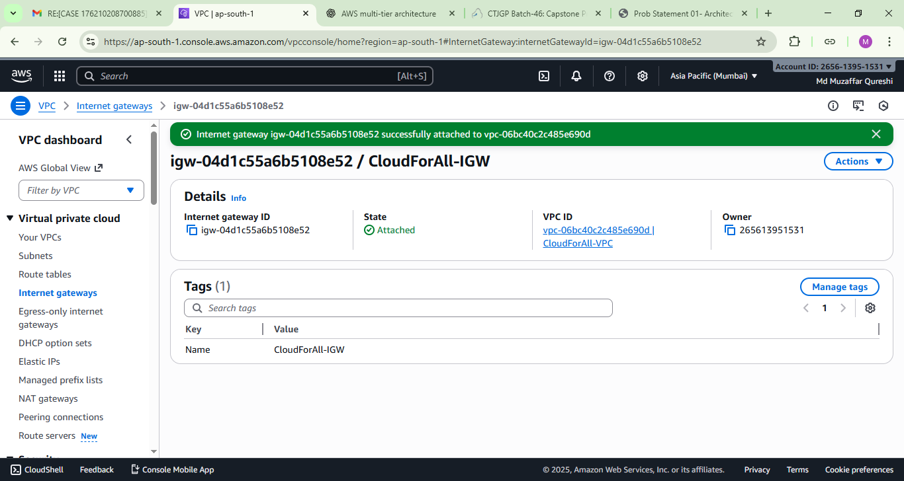

### Public Route Table
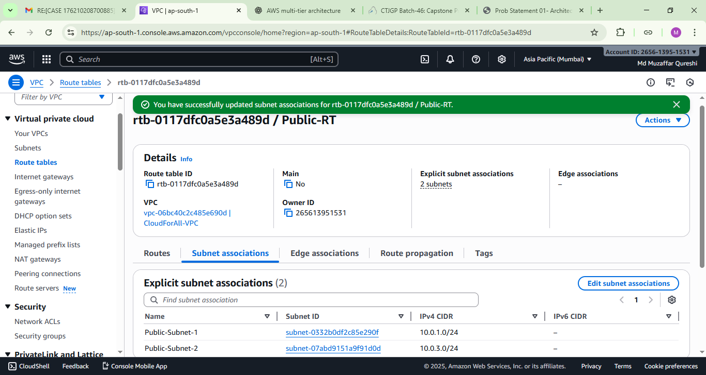

---

## **3️⃣ NAT Gateway & Private Route Table**

### NAT Gateway  

### Private Route Table  
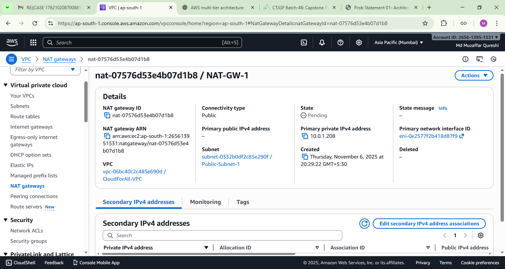

---

## **4️⃣ Security Groups & EC2 Instances**

### Security Groups  
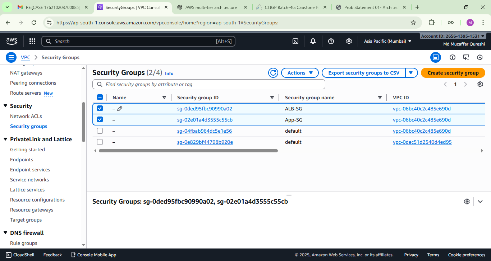

### EC2 Instances  

---

## **5️⃣ Systems Manager (SSM) Access**

### Fleet Manager / SSM  
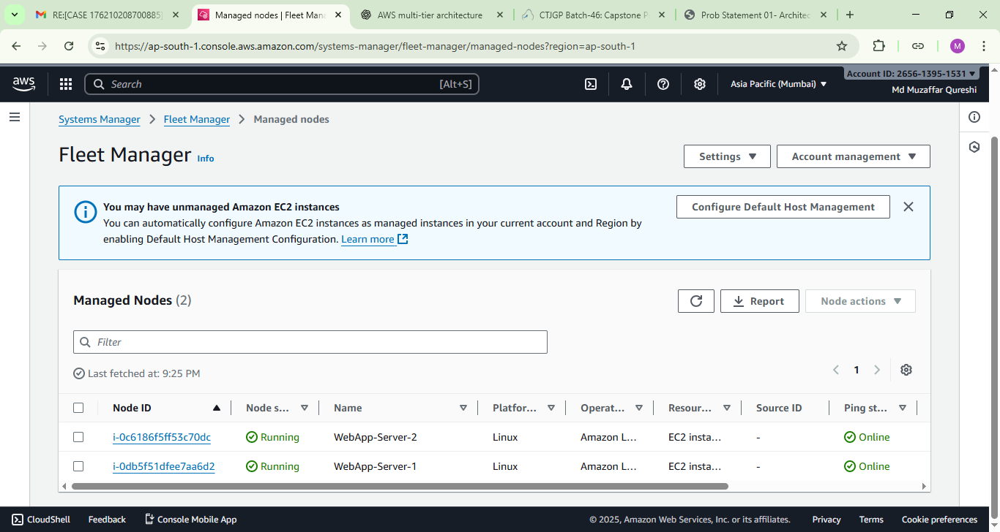

### SSM Role  
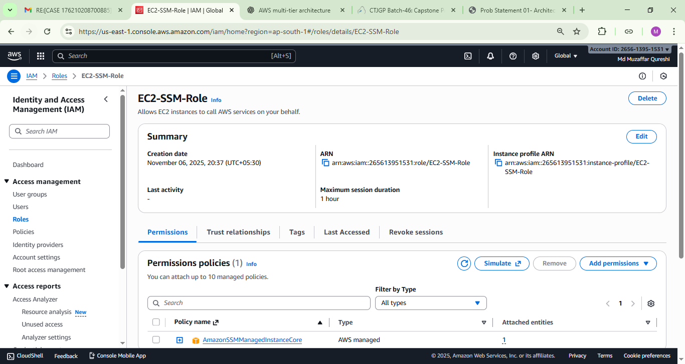

---

## **6️⃣ Target Group & Launch Template**

### Target Group  
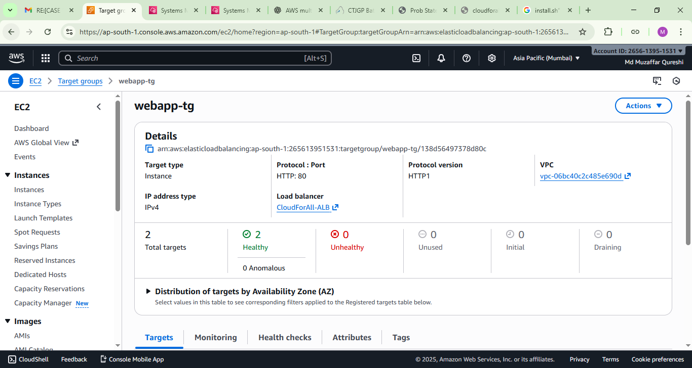

### Launch Template  
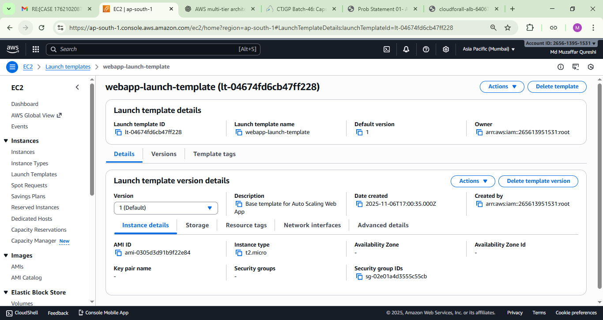

---

## **7️⃣ Auto Scaling Group (ASG)**

### ASG  
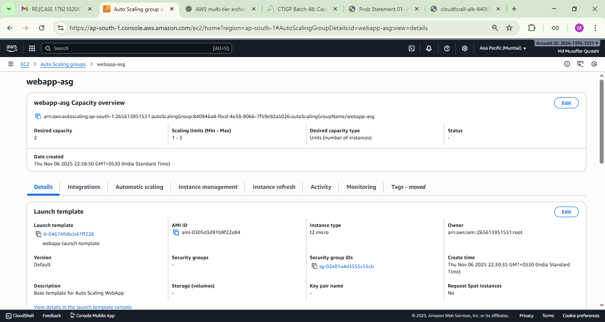

### ASG Activity  
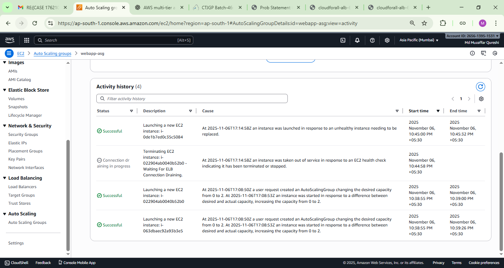

---

## **8️⃣ CloudFront CDN**

### CloudFront Distribution  
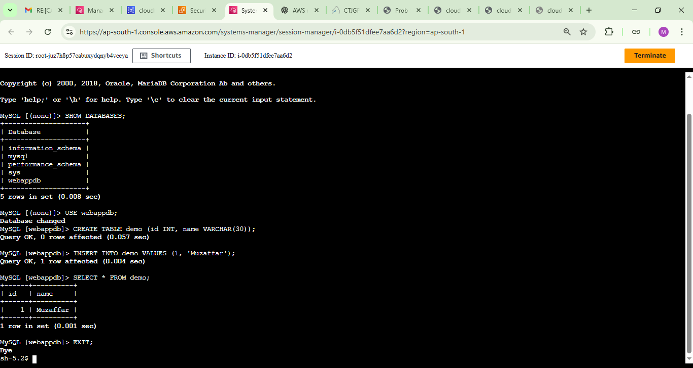

### CloudFront Settings  
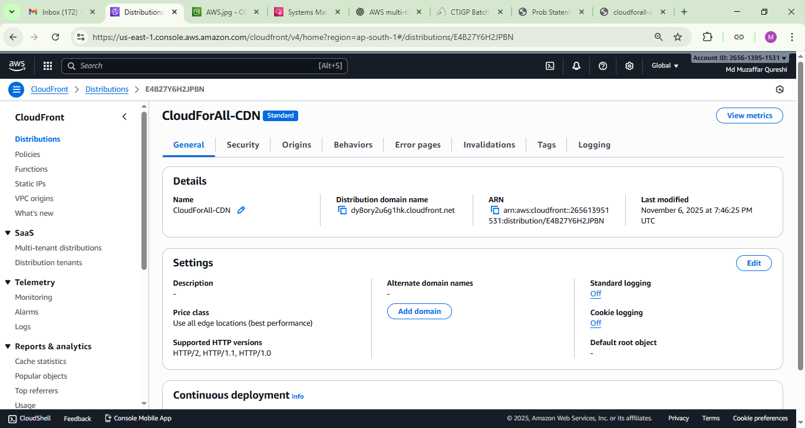

---

# 📌 Project Summary

### ✔️ VPC Design
- CIDR: 10.0.0.0/16  
- **Public Subnets:** For ALB + NAT  
- **Private Subnets:** For EC2 + RDS  
- Public RT → IGW  
- Private RT → NAT  

---

### ✔️ Web Tier
- EC2 Amazon Linux 2023  
- ALB forwards traffic to EC2  
- Auto Scaling based on CPU  
- Launch Template for consistency  
- NGINX configured  

---

### ✔️ Database Tier
- Amazon RDS MySQL  
- Hosted in private subnets  
- Accessible ONLY from WebApp SG  

---

### ✔️ Static Storage + CDN
- S3 bucket for images  
- CloudFront distribution for global low-latency  
- OAC configured to secure bucket  

---

### ✔️ Security
- No SSH access  
- Access through SSM only  
- SG follows least privilege  
- DB not exposed to internet  

---

### ✔️ Monitoring
- CloudWatch CPU alarms  
- Auto Scaling events  
- ALB health checks  

---

# 📝 Author  
**Md Muzaffar Qureshi**  
Capstone Project – Cloud & DevOps  

---

